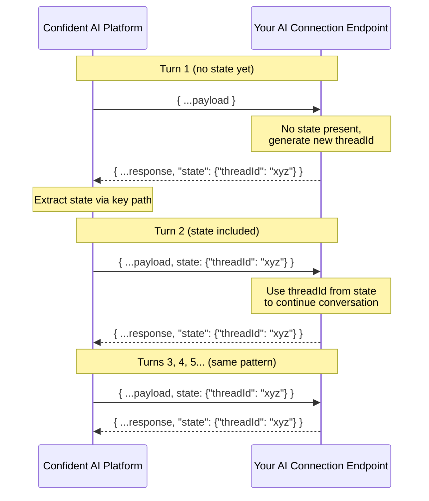
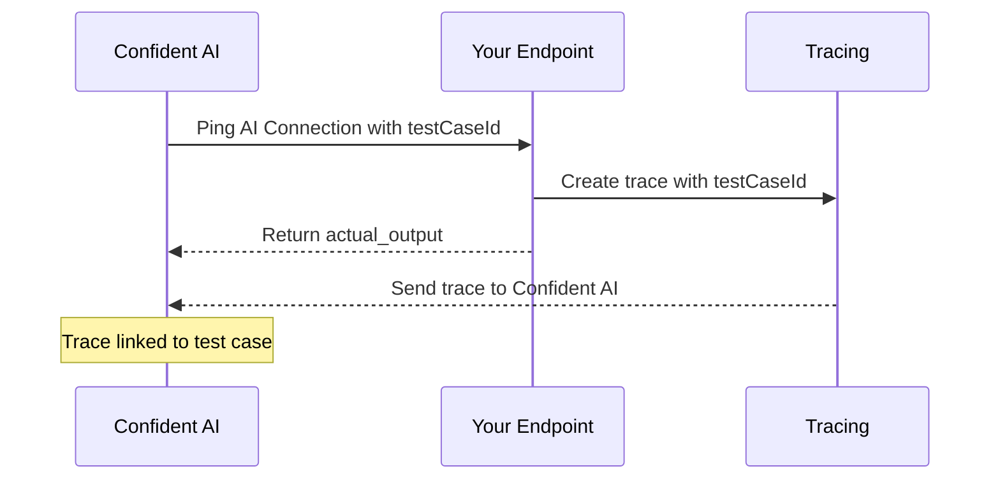
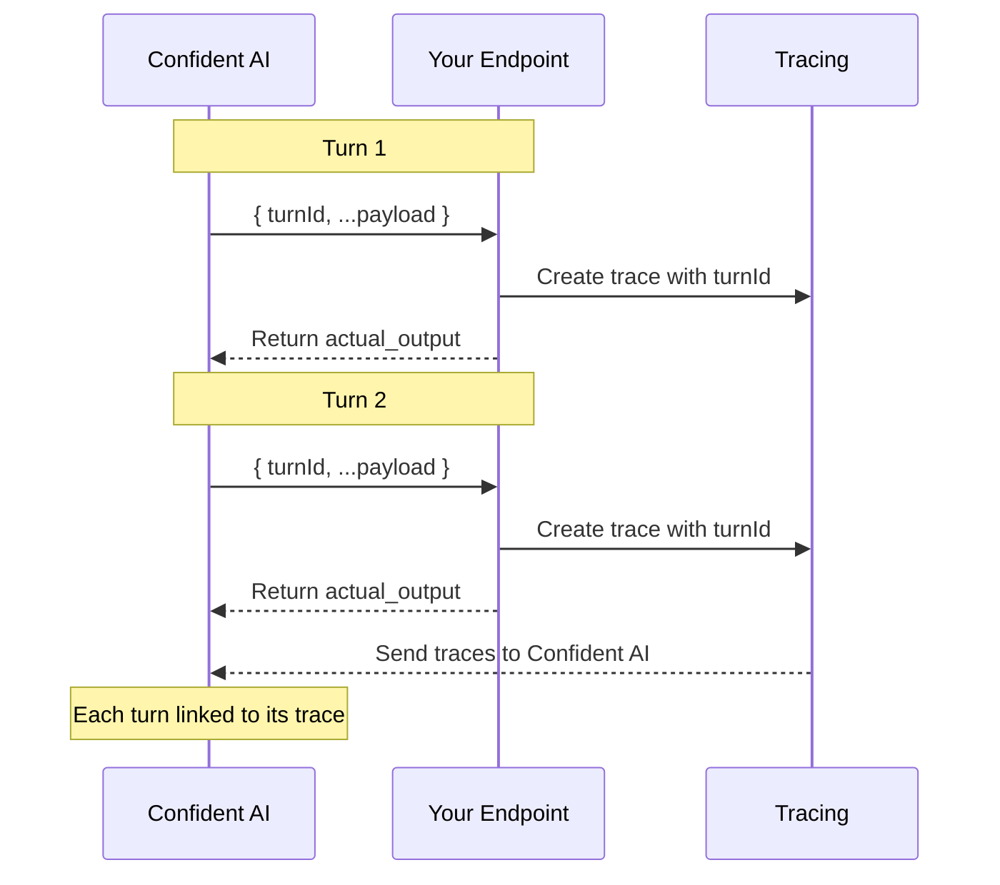

AI Connections let you run evaluations directly on the platform by connecting to your AI app via an HTTPS endpoint. Instead of writing code, you can trigger evaluations with a click of a button—Confident AI will call your endpoint with data from your goldens and parse the response.

<Frame caption="Setup AI Connection">
  
</Frame>

## Setting Up an AI Connection

To create an AI connection:

1. Navigate to **Project Settings** → **AI Connections**
2. Click **New AI Connection**
3. Give it a unique identifying name
4. Click **Save**

<Note>
  Your AI connection won't be usable yet—you still need to configure the
  endpoint, payload, and at minimum the actual output key path.
</Note>

## Configuration Parameters

There are several parameters you'll need to configure in order for your AI connection to work.

### Name

Give your AI connection a unique name to identify it within your project.

### AI App Endpoint

Your AI app **must be accessible via an HTTPS endpoint** that accepts `POST` requests and returns a JSON response containing the actual output of your AI app.

### Payload

Configure the payload that gets sent to your endpoint when Confident AI calls it. **JSON** mode lets you map available variables into a JSON structure, while the **Code** editor lets you write a Python function for conditional logic, data transformation, or full programmatic control over the request body.

<Tabs>

  <Tab title="JSON">

JSON mode lets you define a payload using available variables. You can nest values to match your endpoint's expected structure.

Available variables:

| Variable                                   | Description                                        | Type       |
| ------------------------------------------ | -------------------------------------------------- | ---------- |
| `golden.input`                             | The input from your golden                         | string     |
| `golden.actual_output`                     | The actual output from your golden                 | string     |
| `golden.expected_output`                   | The expected output from your golden               | string     |
| `golden.retrieval_context`                 | The retrieval context from your golden             | string[]   |
| `golden.context`                           | The context from your golden                       | string[]   |
| `golden.expected_tools`                    | The expected tools from your golden                | ToolCall[] |
| `golden.tools_called`                      | The tools called from your golden                  | ToolCall[] |
| `golden.additional_metadata`               | Additional metadata from your golden               | object     |
| `conversationalGolden.turns`               | Turn history for multi-turn evals                  | Turn[]     |
| `conversationalGolden.context`             | Context for conversational goldens                 | string[]   |
| `conversationalGolden.scenario`            | Scenario for conversational goldens                | string     |
| `conversationalGolden.expected_outcome`    | Expected outcome for conversational goldens        | string     |
| `conversationalGolden.user_description`    | User description for conversational goldens        | string     |
| `conversationalGolden.additional_metadata` | Additional metadata for conversational goldens     | object     |
| `prompts`                                  | A dictionary of prompts                            | object     |
| `hyperparameters`                          | A dictionary of hyperparameter key-value pairs     | object     |
| `testCaseId`                               | Unique identifier for linking traces to test cases | string     |
| `turnId`                                   | Unique identifier for linking traces to turns      | string     |
| `state`                                    | An object to keep state for multi-turn simulations | object     |

Use `golden.*` variables for single-turn evaluations and `conversationalGolden.*` variables for multi-turn evaluations. See [Prompts](#prompts) for details on how to use the `prompts` dictionary, and [Hyperparameters](#hyperparameters) for passing hyperparameters to your endpoint.

Example payload:

```json
{
  "input": golden.input,
  "context": golden.context,
  "conversationalContext": conversationalGolden.context,
  "prompts": prompts,
  "hyperparameters": hyperparameters,
  "turns": conversationalGolden.turns
}
```

<Tip>
  The custom payload feature lets you structure the request to match your
  existing API contract—no need to modify your AI app to accept a specific
  format.
</Tip>

  </Tab>

  <Tab title="Code">

Code mode gives you a built-in Python editor where you define a `generate_payload` function. The function receives a `golden` argument (typed as `Union[Golden, ConversationalGolden]`) along with `prompts`, `hyperparameters`, `testCaseId`, `turnId`, and `state`—use `isinstance` checks to handle single-turn and multi-turn goldens differently.

Available `golden` attributes when `golden` is a `Golden`:

| Variable                     | Description                            | Type       |
| ---------------------------- | -------------------------------------- | ---------- |
| `golden.input`               | The input from your golden             | string     |
| `golden.actual_output`       | The actual output from your golden     | string     |
| `golden.expected_output`     | The expected output from your golden   | string     |
| `golden.retrieval_context`   | The retrieval context from your golden | string[]   |
| `golden.context`             | The context from your golden           | string[]   |
| `golden.expected_tools`      | The expected tools from your golden    | ToolCall[] |
| `golden.tools_called`        | The tools called from your golden      | ToolCall[] |
| `golden.additional_metadata` | Additional metadata from your golden   | object     |

Available `golden` attributes when `golden` is a `ConversationalGolden`:

| Variable                     | Description                                    | Type     |
| ---------------------------- | ---------------------------------------------- | -------- |
| `golden.turns`               | Turn history for multi-turn evals              | Turn[]   |
| `golden.context`             | Context for conversational goldens             | string[] |
| `golden.scenario`            | Scenario for conversational goldens            | string   |
| `golden.expected_outcome`    | Expected outcome for conversational goldens    | string   |
| `golden.user_description`    | User description for conversational goldens    | string   |
| `golden.additional_metadata` | Additional metadata for conversational goldens | object   |

Additional parameters:

| Parameter         | Description                                                                  | Type                       |
| ----------------- | ---------------------------------------------------------------------------- | -------------------------- |
| `prompts`         | A dictionary of prompts                                                      | `Optional[Dict[str, str]]` |
| `hyperparameters` | A dictionary of hyperparameter key-value pairs                               | `Optional[Dict[str, str]]` |
| `testCaseId`      | Unique identifier for linking traces to test cases                           | `Optional[str]`            |
| `turnId`          | Unique identifier for linking traces to individual turns in multi-turn evals | `Optional[str]`            |
| `state`           | An object to keep state for multi-turn simulations                           | `Optional[Any]`            |

```python
from deepeval import Golden, ConversationalGolden

def generate_payload(
    golden: Union[Golden, ConversationalGolden],
    prompts: Optional[Dict[str, str]] = None,
    hyperparameters: Optional[Dict[str, str]] = None,
    testCaseId: Optional[str] = None,
    turnId: Optional[str] = None,
    state: Optional[Any] = None,
) -> dict:

    if isinstance(golden, Golden):
        return {
            "input": golden.input,
            "context": golden.context,
            "prompts": prompts,
            "hyperparameters": hyperparameters
        }

    elif isinstance(golden, ConversationalGolden):
        return {
            "turns": golden.turns,
            "conversationContext": golden.context,
            "prompts": prompts,
            "hyperparameters": hyperparameters
        }
```

Whatever the function returns is what gets sent to your endpoint as the POST body.

<Tip>
  Code mode is great when your AI app expects different payload shapes depending
  on the type of evaluation, when you need to preprocess golden data before
  sending it, or when you need to generate dynamic values like UUIDs or
  timestamps on the fly.
</Tip>

  </Tab>

</Tabs>

### Headers

Add any headers required by your endpoint, such as API keys, authentication tokens, or content type specifications. These headers are sent with every request to your AI app.

### Prompts

Associate prompt versions with your AI connection. When running evaluations, these prompts will be attributed to each test run, letting you trace results back to the prompts used.

The `prompts` variable in your payload is a dictionary where each key maps to an object containing `alias` and `version`:

```json
{
  "system": { "alias": "system-prompt", "version": "1.0.0" },
  "assistant": { "alias": "assistant-prompt", "version": "2.1.0" }
}
```

Here's an example of how your Python endpoint might handle the prompts dictionary:

```python
from deepeval.prompt import Prompt

@app.post("/generate")
def generate(request: dict):
    # Pull different prompt versions using their keys
    system_info = request["prompts"]["system"]
    assistant_info = request["prompts"]["assistant"]

    system_prompt = Prompt(alias=system_info["alias"]).pull(version=system_info["version"])
    assistant_prompt = Prompt(alias=assistant_info["alias"]).pull(version=assistant_info["version"])

    # Use the prompts in your generation
    response = llm.generate(
        system=system_prompt.text,
        assistant=assistant_prompt.text,
        user=request["input"]
    )

    return {"output": response}
```

For more details on working with prompts, see [Prompt Versioning](/docs/llm-evaluation/prompt-management/version-prompts).

### Hyperparameters

Define optional hyperparameters as string key-value pairs. These are sent to your endpoint as part of the payload and are also logged in test runs and experiments, making it easy to track which configuration was used for each evaluation.

Hyperparameters are useful for passing model configuration values like `temperature`, `model_name`, or `max_tokens` to your AI app without hardcoding them into your endpoint. Since they're logged alongside test run and experiment results, you can compare how different hyperparameter values affect evaluation outcomes.

The `hyperparameters` variable in your payload is a dictionary where both keys and values are strings:

```json
{
  "temperature": "0.7",
  "model": "gpt-4o",
  "max_tokens": "1024"
}
```

Here's an example of how your Python endpoint might use hyperparameters:

```python
@app.post("/generate")
def generate(request: dict):
    hyperparameters = request.get("hyperparameters", {})

    response = llm.generate(
        model=hyperparameters.get("model", "gpt-4o"),
        temperature=float(hyperparameters.get("temperature", "0.7")),
        max_tokens=int(hyperparameters.get("max_tokens", "1024")),
        user=request["input"]
    )

    return {"output": response}
```

<Note>
  Hyperparameter values are always strings. Cast them to the appropriate type
  (e.g., `float`, `int`) in your endpoint as needed.
</Note>

### Actual Output Key Path

A list of strings or integers representing the path to the `actual_output` value in your JSON response. Use strings for JSON keys and integers for array indices. This is required for evaluation to work.

For example, if your endpoint returns:

```json
{
  "response": {
    "output": "Hello, world!"
  }
}
```

Set the key path to `["response", "output"]`.

For nested arrays, use integers to specify the array index. For example, if your endpoint returns:

```json
{
  "response": {
    "output": {
      "content": [{ "text": "Hello, world!" }]
    }
  }
}
```

Set the key path to `["response", "output", "content", 0, "text"]`.

<Frame caption="Key paths support both JSON keys (strings) and list indices (integers)">
  
</Frame>

### Retrieval Context Key Path

A list of strings or integers representing the path to the `retrieval_context` value in your JSON response. Use strings for JSON keys and integers for array indices. This is optional and only needed if you're using RAG metrics. The value must be a list of strings.

For example, if your endpoint returns:

```json
{
  "response": {
    ...
    "retrieval_context": ["context1", "context2"]
  }
}
```

Set the key path to `["response", "retrieval_context"]`.

### Tool Call Key Path

A list of strings or integers representing the path to the `tools_called` value in your JSON response. Use strings for JSON keys and integers for array indices. This is optional and only needed if you're using metrics that require a tool call parameter. The value must be a list of `ToolCall`.

For example, if your endpoint returns:

```json
{
  "response": {
    ...
    "tools_called": [
      {
        "name": "get_weather",
        "description": "Get weather for a location",
        "reasoning": "User asked about the weather in San Francisco",
        "output": "Sunny, 72°F",
        "inputParameters": {"location": "San Francisco"}
      }
    ]
  }
}
```

Set the key path to `["response", "tools_called"]`.

<Tip>
  For more information on the structure of a tool call, refer to the [official
  DeepEval
  documentation](https://deepeval.com/docs/evaluation-test-cases#tools-called).
</Tip>

### Request Timeout

Set the maximum time (in seconds) that Confident AI will wait for your endpoint to respond before timing out. This helps prevent evaluations from hanging indefinitely if your AI connection is slow or unresponsive.

- **Minimum**: 1 second
- **Default**: 60 seconds

<Note>
  If your AI app performs complex operations or calls external services, you may
  need to increase the timeout to avoid premature failures.
</Note>

### Max Concurrency

Set the maximum number of concurrent requests that Confident AI will send to your endpoint at the same time. This helps prevent overwhelming your AI app during large evaluation runs.

- **Minimum**: 1
- **Default**: 20

### Max Retries

Set the maximum number of times Confident AI will retry a failed request to your endpoint. This helps handle transient errors without failing the entire evaluation.

- **Minimum**: 0
- **Default**: 0

### Response Mode

Choose how Confident AI should interpret your endpoint's response. The default is **HTTP Response**, which expects a single JSON response body. For streaming endpoints, choose one of the streaming modes.

| Mode | Description | Content-Type |
| --- | --- | --- |
| HTTP Response | Standard request-response. Your endpoint returns a single JSON body. | `application/json` |
| SSE Streaming | Server-Sent Events. Each event is prefixed with `data:` and the stream ends with `data: [DONE]`. | `text/event-stream` |
| HTTP Streaming | NDJSON (Newline-Delimited JSON). Each line of the response body must be a valid JSON object, separated by newlines. | `application/x-ndjson` or `application/json` |

#### HTTP Streaming (NDJSON)

When using HTTP Streaming, your endpoint must return responses in [NDJSON format](https://github.com/ndjson/ndjson-spec) -- one JSON object per line, separated by newline characters (`\n`).

Example response body:

```
{"chunk": "Hello"}
{"chunk": " world"}
{"chunk": "!"}
```

Each line is parsed independently as JSON. Empty lines are ignored. If any non-empty line is not valid JSON, the request will fail with an error indicating which line could not be parsed.

<Note>
  Raw text streaming (sending plain text chunks without JSON wrapping) is **not supported** in HTTP Streaming mode. If your endpoint streams plain text, either wrap each chunk in a JSON object or use a different response mode.
</Note>

#### SSE Streaming

When using SSE Streaming, your endpoint should follow the [Server-Sent Events](https://developer.mozilla.org/en-US/docs/Web/API/Server-sent_events) standard. Each event should be prefixed with `data:` and contain a JSON object. Signal the end of the stream with `data: [DONE]`.

Example response body:

```
data: {"chunk": "Hello"}
data: {"chunk": " world"}
data: [DONE]
```

## Configure Multiturn State

During multi-turn simulations, Confident AI calls your endpoint once per turn. You can use state to persist information—like a thread ID or session—across turns so your AI app can maintain context throughout the conversation.

On the **first turn**, the `state` variable in your payload will be empty since no prior state exists. If your endpoint returns a state object and the state key path successfully extracts it, that state will be included in the `state` payload variable from the **second turn onwards**.



### Payload

To enable multiturn state, include `state` in your payload configuration so it gets sent to your endpoint on each turn:

```json
{
  "input": golden.input,
  "state": state
}
```

Here's an example of how your endpoint might handle state:

```python
@app.post("/generate")
def generate(request: dict):
    state = request.get("state", {})

    if not state:
        thread_id = create_new_thread()
    else:
        thread_id = state["threadId"]

    response = llm.generate(
        thread_id=thread_id,
        user=request["input"]
    )

    return {
        "output": response,
        "state": {"threadId": thread_id}
    }
```

### State Key Path

The state key path works just like the actual output key path—a list of strings or integers representing the path to the `state` object in your JSON response. This tells Confident AI where to extract state from your endpoint's response so it can be passed back on the next turn.

For example, if your endpoint returns:

```json
{
  "output": "Hello! How can I help?",
  "state": {
    "threadId": "abc-123"
  }
}
```

Set the state key path to `["state"]`.

<Note>
  State is only relevant for multi-turn evaluations (simulations). For
  single-turn evaluations, you can ignore this setting entirely.
</Note>

## Linking Test Cases to Traces

For single-turn evaluations, you can link each test case to its corresponding trace for full observability. This is done by including `testCaseId` in your payload (enabled by default) and passing it to your tracing setup.



Include `testCaseId` in your payload configuration and ensure your AI connection is configured to accept it.

```json
{
  "input": golden.input,
  "testCaseId": testCaseId
}
```

Then, pass the `testCaseId` to your tracing implementation:

<Tabs>

  <Tab title="Python">

```python
from deepeval.tracing import observe, update_current_trace

@observe()
def llm_app(input: str, test_case_id: str):
    update_current_trace(test_case_id=test_case_id)

    response = llm.generate(user=input)
    return response

@app.post("/generate")
def generate(request: dict):
    test_case_id = request.get("testCaseId")
    response = llm_app(request["input"], test_case_id)
    return {"output": response}
```

  </Tab>
  <Tab title="TypeScript">

```typescript
import OpenAI from "openai";
import { instrumentOpenAI } from "deepeval/openai";
import { setTracingContext } from "deepeval/tracing";

const client = new OpenAI();
instrumentOpenAI(client);

const main = async () => {
  await setTracingContext(
    { 
      testCaseId: "tc_123" 
    },
    async () => {
      const response = await client.chat.completions.create({
        model: "gpt-4o",
        messages: [
          { role: "system", content: "You are a helpful assistant." },
          { role: "user", content: "What is the weather in France?" },
        ],
      });
      console.log(response);
    }
  );
};

main();
```

  </Tab>
  <Tab title="LangChain">

```python
from langchain.agents import create_tool_calling_agent, AgentExecutor
from deepeval.integrations.langchain import CallbackHandler
...

@app.post("/generate")
def generate(request: dict):
    test_case_id = request.get("testCaseId")

    result = agent_executor.invoke(
        {"input": request["input"]},
        config={"callbacks": [CallbackHandler(test_case_id=test_case_id)]}
    )
    return {"output": result["output"]}
```

  </Tab>
  <Tab title="LangGraph">

```python
from langgraph.prebuilt import create_react_agent
from deepeval.integrations.langchain import CallbackHandler
...

@app.post("/generate")
def generate(request: dict):
    test_case_id = request.get("testCaseId")

    result = agent.invoke(
        {"messages": [{"role": "user", "content": request["input"]}]},
        config={"callbacks": [CallbackHandler(test_case_id=test_case_id)]}
    )
    return {"output": result["messages"][-1].content}
```

  </Tab>
  <Tab title="OpenTelemetry">

```python
@app.post("/generate")
def generate(request: dict):
    test_case_id = request.get("testCaseId")

    with tracer.start_as_current_span("llm_app") as span:
        span.set_attribute("confident.trace.test_case_id", test_case_id)

        response = llm.generate(user=request["input"])
        return {"output": response}
```

  </Tab>
  <Tab title="Vercel AI SDK">

```typescript
import { generateText } from "ai";

const { text } = await generateText({
  model: "openai/gpt-4o",
  prompt: "How to make the best coffee?",
  experimental_telemetry: {
    isEnabled: true,
    metadata: {
      testCaseId: "tc_123",
    }
  },
});
console.log(text);
```

  </Tab>
  <Tab title="OpenInference">
<CodeBlocks>
```python
import os
from openinference.instrumentation.langchain import LangChainInstrumentor
from langchain_openai import ChatOpenAI
from deepeval.integrations.openinference import instrument_openinference

LangChainInstrumentor().instrument()

instrument_openinference(
  test_case_id="tc_123",
)

llm = ChatOpenAI(model="gpt-4o-mini")
result = llm.invoke("What are LLMs?")
```

```typescript
import { instrumentOpenInference } from "deepeval/integrations/openinference";
import { registerInstrumentations } from "@opentelemetry/instrumentation";
import { OpenAIInstrumentation } from "@arizeai/openinference-instrumentation-openai";

instrumentOpenInference({
  testCaseId: "tc_123",
});

registerInstrumentations({
  instrumentations: [new OpenAIInstrumentation()],
});

async function main() {
  const { default: OpenAI } = await import("openai");
  const client = new OpenAI();
  await client.chat.completions.create({
    model: "gpt-4o-mini",
    messages: [{ role: "user", content: "What is OpenInference?" }],
  });
}
```
</CodeBlocks>

  </Tab>
</Tabs>

<Tip>
  Once linked, you can view the full trace for each test case directly from the
  evaluation results, making it easy to debug failures and understand model
  behavior.
</Tip>

## Linking Turns to Traces

For multi-turn evaluations, Confident AI calls your endpoint once per turn. Each turn has its own `turnId` that you can pass to your tracing setup. This links each turn's trace to the specific turn in the conversation, letting you view traces per-turn from the evaluation results.



Include `turnId` in your payload configuration:

```json
{
  "input": golden.input,
  "turnId": turnId,
  "state": state
}
```

Then, pass the `turnId` to your tracing implementation:

<Tabs>

  <Tab title="Python">

```python
from deepeval.tracing import observe, update_current_trace

@observe()
def llm_app(input: str, turn_id: str):
    update_current_trace(turn_id=turn_id)

    response = llm.generate(user=input)
    return response

@app.post("/generate")
def generate(request: dict):
    turn_id = request.get("turnId")
    response = llm_app(request["input"], turn_id)
    return {"output": response}
```

  </Tab>
  <Tab title="TypeScript">

```typescript
import OpenAI from "openai";
import { instrumentOpenAI } from "deepeval/openai";
import { setTracingContext } from "deepeval/tracing";

const client = new OpenAI();
instrumentOpenAI(client);

const main = async () => {
  await setTracingContext(
    { 
      turnId: "turn_123" 
    },
    async () => {
      const response = await client.chat.completions.create({
        model: "gpt-4o",
        messages: [
          { role: "system", content: "You are a helpful assistant." },
          { role: "user", content: "What is the weather in France?" },
        ],
      });
      console.log(response);
    }
  );
};

main();
```

  </Tab>
  <Tab title="LangChain">

```python
from langchain.agents import create_tool_calling_agent, AgentExecutor
from deepeval.integrations.langchain import CallbackHandler
...

@app.post("/generate")
def generate(request: dict):
    turn_id = request.get("turnId")

    result = agent_executor.invoke(
        {"input": request["input"]},
        config={"callbacks": [CallbackHandler(turn_id=turn_id)]}
    )
    return {"output": result["output"]}
```

  </Tab>
  <Tab title="LangGraph">

```python
from langgraph.prebuilt import create_react_agent
from deepeval.integrations.langchain import CallbackHandler
...

@app.post("/generate")
def generate(request: dict):
    turn_id = request.get("turnId")

    result = agent.invoke(
        {"messages": [{"role": "user", "content": request["input"]}]},
        config={"callbacks": [CallbackHandler(turn_id=turn_id)]}
    )
    return {"output": result["messages"][-1].content}
```

  </Tab>
  <Tab title="OpenTelemetry">

```python
@app.post("/generate")
def generate(request: dict):
    turn_id = request.get("turnId")

    with tracer.start_as_current_span("llm_app") as span:
        span.set_attribute("confident.trace.turn_id", turn_id)

        response = llm.generate(user=request["input"])
        return {"output": response}
```

  </Tab>
  <Tab title="Vercel AI SDK">

```typescript
import { generateText } from "ai";

const { text } = await generateText({
  model: "openai/gpt-4o",
  prompt: "How to make the best coffee?",
  experimental_telemetry: {
    isEnabled: true,
    metadata: {
      turnId: "turn_123",
    }
  },
});
console.log(text);
```

  </Tab>
  <Tab title="OpenInference">
<CodeBlocks>
```python
import os
from openinference.instrumentation.langchain import LangChainInstrumentor
from langchain_openai import ChatOpenAI
from deepeval.integrations.openinference import instrument_openinference

LangChainInstrumentor().instrument()

instrument_openinference(
  turn_id="turn_123",
)

llm = ChatOpenAI(model="gpt-4o-mini")
result = llm.invoke("What are LLMs?")
```

```typescript
import { instrumentOpenInference } from "deepeval/integrations/openinference";
import { registerInstrumentations } from "@opentelemetry/instrumentation";
import { OpenAIInstrumentation } from "@arizeai/openinference-instrumentation-openai";

instrumentOpenInference({
  turnId: "turn_123",
});

registerInstrumentations({
  instrumentations: [new OpenAIInstrumentation()],
});

async function main() {
  const { default: OpenAI } = await import("openai");
  const client = new OpenAI();
  await client.chat.completions.create({
    model: "gpt-4o-mini",
    messages: [{ role: "user", content: "What is OpenInference?" }],
  });
}
```
</CodeBlocks>

  </Tab>
</Tabs>

<Tip>
  With `turnId` linked, you can click "Open trace" on any individual turn in the
  evaluation results to see the full trace for that specific turn.
</Tip>

## Testing Your Connection

After configuring your AI connection, click **Ping Endpoint** to verify everything is set up correctly. You should receive a `200` status response. If not, check the error message and adjust your configuration accordingly.
